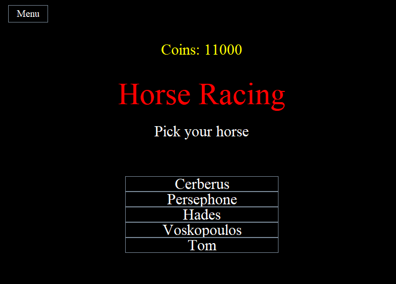
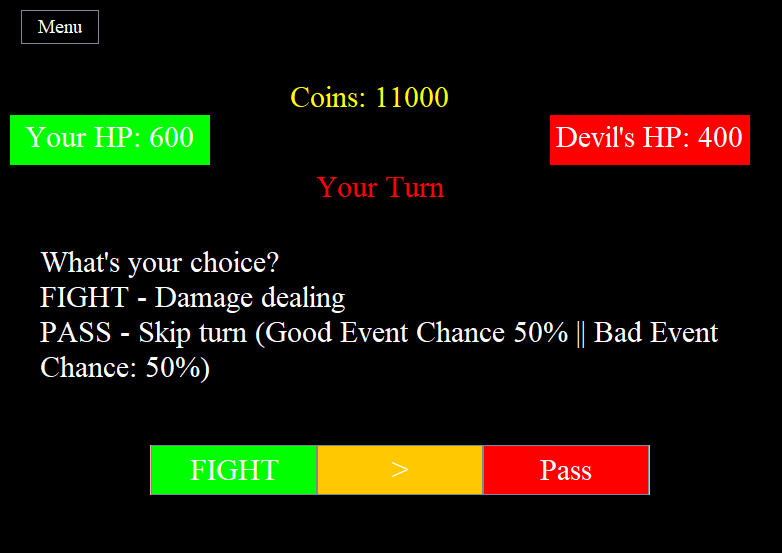

# Soul Array

A gambling simulation game, made using Java.

## Features

- Timers and delays
- Has 3 games
- Buy organs
- Sell organs
- Unique old school design
- Includes a turn-based fighting game

## Screenshots

## Feedback

If you have any feedback, or have spotted a bug, please reach out to me at elizanjaredr@gmail.com

## Authors

- [@Endaashdw](https://github.com/Endaashdw)
- [@407proxy](https://github.com/407proxy)
- [@jarede-dev](https://github.com/jarede-dev)

## License

[GPLv3](https://choosealicense.com/licenses/gpl-3.0/)

